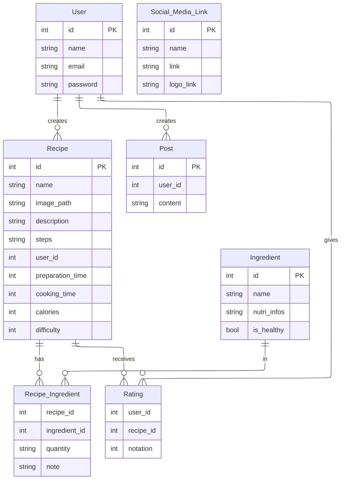

# Guide de Recettes de Cuisine

Site web de gestion de recettes de cuisine développé dans le cadre du module TDW 2CS.

## 🎯 Description

Plateforme web complète permettant la gestion et la découverte de recettes de cuisine avec une interface publique et un panneau d'administration.

## ⚙️ Technologies Utilisées

- HTML5
- CSS3
- JavaScript
- PHP
- Laravel
- turtle
- rdf

## 🚀 Fonctionnalités

### Partie Publique

- Page d'accueil avec diaporama et menu horizontal
- Catégories de recettes (entrées, plats, desserts, boissons)
- Recherche de recettes par ingrédients
- Filtres par temps, calories, notation
- Système d'authentification utilisateur
- Notation et ajout de recettes (utilisateurs connectés)
- Partager des publications

### Administration

- Gestion des recettes et validation
- Gestion des utilisateurs
- Gestion des publications
- Gestion des ingrédients et nutrition
- Paramétrage du site

### Schéma Entité-Relation

