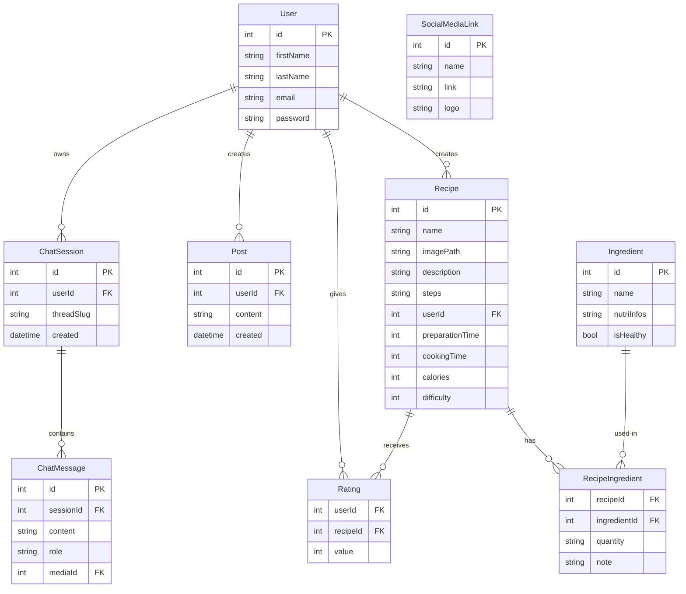

# 🍳 Kitchen Exchange

**Plateforme collaborative de partage et découverte de recettes de cuisine avec assistant IA intelligent**

## 🎯 Description

Kitchen Exchange est une plateforme web complète permettant la gestion et la découverte de recettes de cuisine. Elle combine une interface publique intuitive avec un panneau d'administration puissant, le tout enrichi par un assistant culinaire IA avec support vocal.

## 🎨 Technologies Utilisées

### Frontend
- **HTML5** - Structure des pages
- **CSS3** - Styles et animations (variables CSS personnalisées)
- **JavaScript ES6+** - Logique client et modules
- **Web Audio API** - Enregistrement et visualisation audio

### Backend & Data
- **Omeka S** - Système de gestion de contenu sémantique et API REST
- **RDF/Turtle** - Vocabulaire personnalisé (`ke:` namespace)
- **AnythingLLM** - Plateforme RAG (Retrieval-Augmented Generation) pour l'IA
- **Whisper API** - Transcription vocale automatique
- **FastAPI** - Serveur de transcription audio

### Architecture
- **Architecture modulaire** - Modules JavaScript réutilisables (`omk.js`, `auth.js`, etc.)
- **Stockage sémantique** - Données structurées avec classes et propriétés RDF
- **API-First** - Communication via API REST Omeka S
- **LocalStorage** - Gestion de sessions et paramètres utilisateur

## ✨ Fonctionnalités

### 🌐 Interface Publique

#### Navigation & Découverte
- **Page d'accueil dynamique** avec carousel de recettes populaires
- **Catalogue de recettes** avec pagination et tri
- **Système de catégories** (entrées, plats, desserts, boissons)
- **Recherche multi-critères** :
  - Par nom de recette
  - Par ingrédients (sélection multiple)
  - Par temps de préparation/cuisson
  - Par niveau de calories
  - Par note moyenne

#### Gestion Utilisateur
- **Authentification sécurisée** (inscription/connexion)
- **Profil utilisateur** avec informations personnelles
- **Ajout de recettes** avec upload d'image
- **Système de notation** (étoiles 1-5)
- **Partage de publications** sur le fil d'actualité

#### Assistant IA Culinaire 🤖
- **Chat conversationnel** avec IA contextuelle
- **RAG (Retrieval-Augmented Generation)** - L'IA connaît toutes vos recettes
- **Gestion de conversations multiples** avec historique
- **Support vocal** :
  - Enregistrement audio avec visualisation en temps réel
  - Transcription automatique via Whisper
  - Envoi et stockage des messages vocaux
  - Lecture des enregistrements
- **Références intelligentes** - Liens automatiques vers recettes (RECIPE-123)
- **Contexte de conversation** - Chaque session maintient son historique

### 🛠️ Panneau d'Administration

#### Gestion des Contenus
- **Recettes** :
  - Création/modification/suppression avec upload d'images
  - Association d'ingrédients avec quantités
  - Validation et modération
  - Suppression en cascade (recette + associations)
- **Ingrédients** :
  - Base de données d'ingrédients
  - Informations nutritionnelles
  - Marqueur santé (is_healthy)
  - Suppression gracieuse avec nettoyage des relations
- **Utilisateurs** :
  - Liste complète des utilisateurs
  - Gestion des permissions
  - Statistiques d'activité
- **Publications** :
  - Modération du fil d'actualité
  - Suppression avec gestion d'erreurs
- **Enregistrements vocaux** :
  - Accès aux messages vocaux
  - Gestion et suppression

#### Statistiques & Analytics
- **Dashboard** avec métriques en temps réel :
  - Nombre total de recettes
  - Nombre d'utilisateurs actifs
  - Publications partagées
  - Ingrédients disponibles
  - Messages enregistrés

#### Configuration Système
- **Paramètres AnythingLLM** :
  - URL de l'API
  - Clé d'authentification
  - Workspace slug
  - Endpoint Whisper pour transcription
- **MyModule - Synchronisation RAG** :
  - Export automatique vers AnythingLLM
  - Format de document enrichi `[TYPE-ID] Title`
  - Sélection de types de ressources (Recipe, Ingredient, User, Post)
  - Filtrage par ItemSets
  - Jobs asynchrones de synchronisation

## 🏗️ Architecture & Modèle de Données

### Schéma Entité-Relation



### Vocabulaire RDF Personnalisé (`ke:` namespace)

**Classes principales:**
- `ke:Recipe` - Recette de cuisine
- `ke:Ingredient` - Ingrédient
- `ke:RecipeIngredient` - Association recette-ingrédient
- `ke:User` - Utilisateur
- `ke:Post` - Publication
- `ke:Rating` - Note/évaluation
- `ke:SocialMediaLink` - Lien réseau social
- `ke:ChatSession` - Session de conversation
- `ke:ChatMessage` - Message de chat

**Propriétés clés:**
- `ke:name`, `ke:steps`, `ke:preparationTime`, `ke:cookingTime`, `ke:calories`
- `ke:quantity`, `ke:note` (pour RecipeIngredient)
- `ke:content`, `ke:role`, `ke:belongsToSession` (pour ChatMessage)
- `ke:threadSlug`, `ke:belongsToUser` (pour ChatSession)
- `ke:hasVoiceRecording` - Lien vers média audio

## 🚀 Installation & Configuration

### Prérequis

- **Serveur Web** (Apache/Nginx)
- **PHP 7.4+** avec extensions requises par Omeka S
- **MySQL/MariaDB**
- **Omeka S** installé et configuré
- **Node.js 16+** (pour AnythingLLM)
- **Python 3.8+** (pour Whisper API)

### Étape 1: Configuration Omeka S

1. **Installer le vocabulaire personnalisé:**
   ```bash
   # Importer assets/vocab.ttl dans Omeka S
   # Via: Administration → Vocabularies → Import
   ```

2. **Importer les Resource Templates:**
   ```bash
   # Importer tous les fichiers JSON depuis assets/rt/
   # Recipe.json, Ingredient.json, User.json, Post.json
   # ChatSession.json, ChatMessage.json, etc.
   ```

3. **Installer MyModule:**
   ```bash
   sudo cp -r MyModule /var/www/html/omeka-s/modules/
   # Activer le module dans Omeka S admin
   ```

4. **Créer les clés API:**
   - Aller dans Omeka S → User → API Keys
   - Générer une nouvelle clé
   - Noter l'identity et le credential

### Étape 2: Installation AnythingLLM

```bash
# Installer AnythingLLM
git clone https://github.com/Mintplex-Labs/anything-llm.git
cd anything-llm
npm install
npm run dev

# L'API sera disponible sur http://localhost:3001
```

**Configuration:**
1. Créer un workspace nommé `kitchen-exchange`
2. Générer une clé API
3. Configurer un LLM (GPT-4, Claude, Ollama, etc.)

### Étape 3: Installation Whisper API

```bash
# Installer les dépendances Python
pip install fastapi uvicorn openai-whisper python-multipart

# Démarrer le serveur
python whisper_server_fixed.py

# L'API sera disponible sur http://localhost:8000
```

### Étape 4: Configuration du Frontend

1. **Mettre à jour les credentials dans les fichiers JS:**
   ```javascript
   // js/chat.js, js/admin.js, etc.
   const omk = new Omk({
       api: 'http://localhost/omeka-s/api/',
       ident: 'VOTRE_KEY_IDENTITY',
       key: 'VOTRE_KEY_CREDENTIAL',
       mail: 'votre.email@example.com',
       vocabs: ['ke', 'dcterms', 'foaf']
   });
   ```

2. **Configurer AnythingLLM via l'interface admin:**
   - Ouvrir `admin.html`
   - Onglet "Settings"
   - Remplir:
     - API URL: `http://localhost:3001/api`
     - API Key: Votre clé AnythingLLM
     - Workspace Slug: `kitchen-exchange`
     - Whisper Endpoint: `http://localhost:8000/transcribe`
   - Sauvegarder

### Étape 5: Import des Données Initiales (Optionnel)

```bash
# Importer les données de test depuis assets/csv/
# Via: Omeka S → CSV Import module
```

## 📖 Guide d'Utilisation

### Pour les Utilisateurs

1. **Créer un compte:**
   - Cliquer sur "Connexion" → "S'inscrire"
   - Remplir le formulaire
   - Se connecter

2. **Ajouter une recette:**
   - Aller sur "Ajouter une Recette"
   - Remplir nom, ingrédients, étapes
   - Uploader une image
   - Soumettre

3. **Utiliser l'assistant vocal:**
   - Ouvrir "Assistant"
   - Cliquer "🎤 Envoyer un message vocal"
   - Enregistrer votre question
   - L'IA répond avec des suggestions de recettes

### Pour les Administrateurs

1. **Gérer le contenu:**
   - Onglet "Recettes" - Valider/Modifier/Supprimer
   - Onglet "Utilisateurs" - Gérer les comptes
   - Onglet "Ingrédients" - Enrichir la base

2. **Synchroniser avec l'IA:**
   - Aller dans Omeka S → MyModule → Sync to RAG
   - Sélectionner les types de ressources
   - Lancer le job
   - Les données sont exportées vers AnythingLLM

3. **Monitorer:**
   - Dashboard pour statistiques
   - Logs pour debugging

## 🎤 Fonctionnement de l'Assistant Vocal

### Pipeline de Traitement

```
1. User clicks "🎤 Envoyer un message vocal"
   ↓
2. MediaRecorder captures audio (WebM/Opus)
   ↓
3. Visualization shows real-time waveform
   ↓
4. User stops recording → Blob created
   ↓
5. Audio sent to Whisper API (POST /transcribe)
   ↓
6. Whisper returns transcription text
   ↓
7. Text + Audio saved to Omeka (ChatMessage + Media)
   ↓
8. Text sent to AnythingLLM with conversation context
   ↓
9. AI response with recipe references (RECIPE-123)
   ↓
10. Response displayed with clickable links
```

### Format des Messages

**Messages utilisateur avec audio:**
- Texte: Transcription Whisper
- Média: Fichier audio `.webm`
- Propriétés: `ke:content`, `ke:role=user`, `ke:belongsToSession`

**Réponses de l'IA:**
- Texte avec références formatées: `[RECIPE-123]`
- Auto-conversion en liens cliquables
- Contexte maintenu via `threadSlug`

## 🔗 Liens Intelligents

L'IA utilise un système de références pour lier ses réponses aux données Omeka:

- `RECIPE-123` → Lien vers `recipe-detail.html?id=123` 🍳
- `INGREDIENT-45` → Référence à un ingrédient 🥕
- `USER-7` → Référence à un utilisateur 👤
- `POST-89` → Lien vers une publication 📝

Ces références sont automatiquement détectées et converties en liens cliquables.

Readme file généré avec Claude Sonnet 4.5 avec la commande suivante: Based on the context and the current website's functionnalites and everything, please update the readme file.