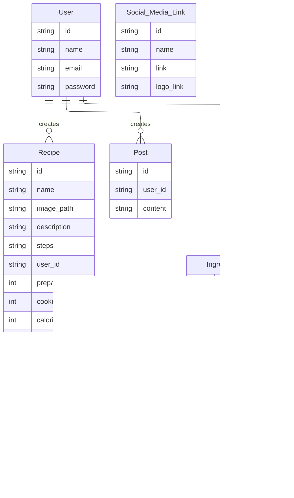

# Guide de Recettes de Cuisine

Site web de gestion de recettes de cuisine développé dans le cadre du module TDW 2CS.

## 🎯 Description

Plateforme web complète permettant la gestion et la découverte de recettes de cuisine avec une interface publique et un panneau d'administration.

## ⚙️ Technologies Utilisées

- HTML5
- CSS3
- JavaScript
- PHP
- Laravel
- turtle
- rdf

## 🚀 Fonctionnalités

### Partie Publique

- Page d'accueil avec diaporama et menu horizontal
- Catégories de recettes (entrées, plats, desserts, boissons)
- Recherche de recettes par ingrédients
- Filtres par temps, calories, notation
- Système d'authentification utilisateur
- Notation et ajout de recettes (utilisateurs connectés)
- Partager des publications

### Administration

- Gestion des recettes et validation
- Gestion des utilisateurs
- Gestion des publications
- Gestion des ingrédients et nutrition
- Paramétrage du site

### Schéma Entité-Relation

```mermaid
---
config:
  layout: elk
  look: classic
---
erDiagram
    User ||--o{ Recipe : creates
    User ||--o{ Post : creates
    Recipe ||--o{ Recipe_Ingredient : has
    Ingredient ||--o{ Recipe_Ingredient : in
    User ||--o{ Rating : gives
    Recipe ||--o{ Rating : receives

    User {
        string id
        string name
        string email
        string password
    }
  
    Social_Media_Link {
        string id
        string name
        string link
        string logo_link
    }
  
    Recipe {
        string id
        string name
        string image_path
        string description
        string steps
        string user_id
        int preparation_time
        int cooking_time
        int calories
        int difficulty
    }
  
    Rating {
        string user_id
        string recipe_id
        int notation
    }
  
    Post {
        string id
        string user_id
        string content
    }
  
    Ingredient {
        string id
        string name
        string nutri_infos
        bool is_healthy
    }
  
    Recipe_Ingredient {
        string recipe_id
        string ingredient_id
        string quantity
        string note
    }
```
